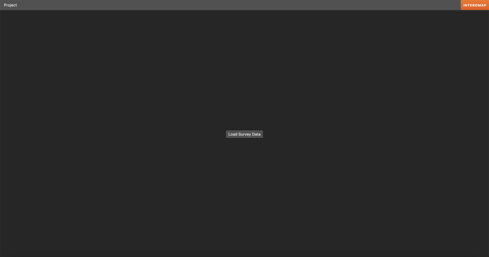
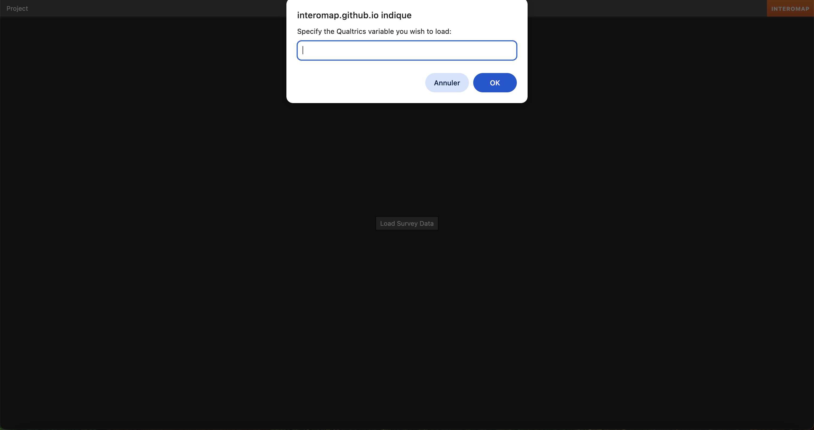
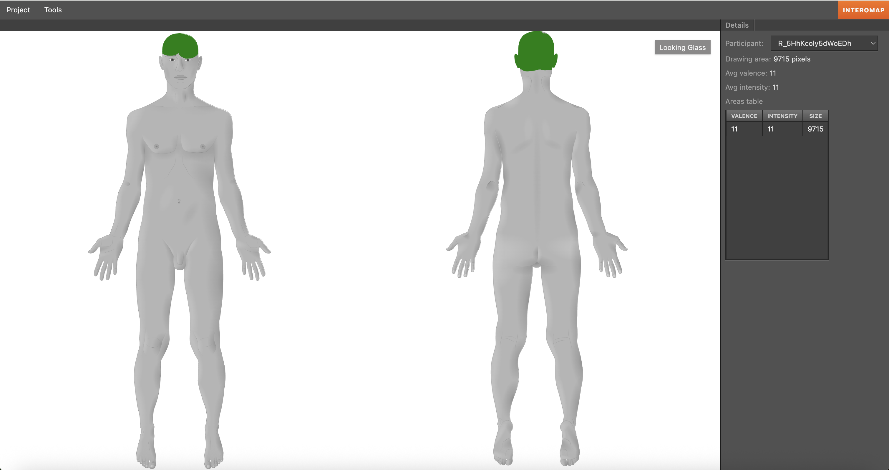
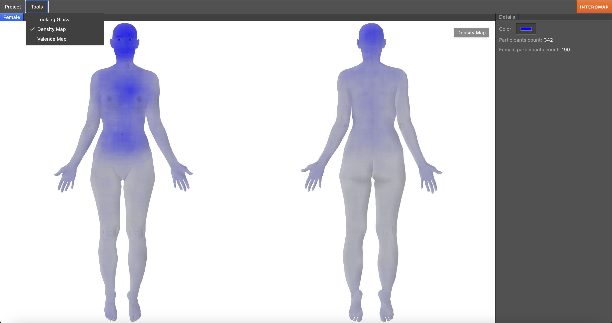
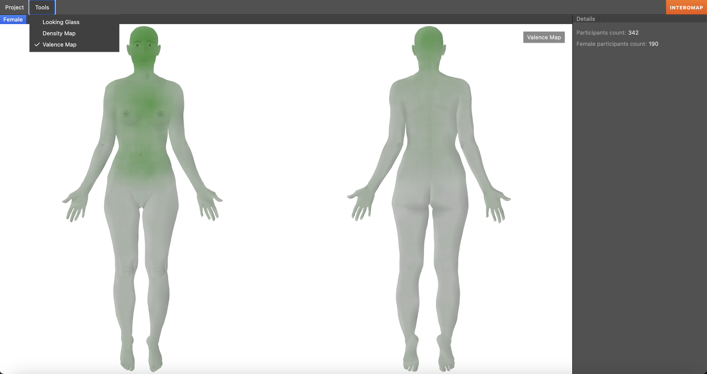
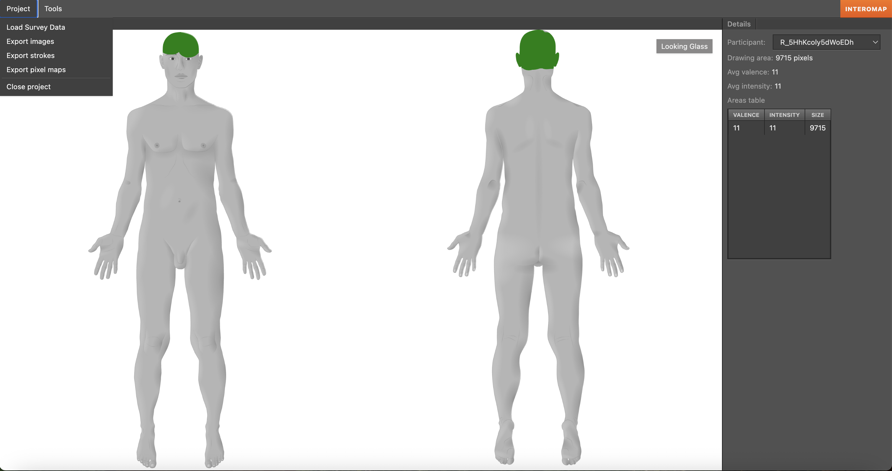

# Getting started

## Associated publication
Please cite:
Desmedt, O., Maurage, P., Leganes-Fonteneau, M., Billaux, P., & Billieux, J. (2025).
InteroMap: A Novel Tool to Map the Phenomenology of Bodily Sensations.

## Processing tool

The following instructions will show you how to visualize and extract 
InteroMap data.

Here is an overview of the procedure:

1. Load Survey Data by specifying the Qualtrics variable you wish to load.
2. Visualize individual and aggregated bodily maps.
3. Extract data and images.

Note: If you use InteroMap multiple times in your survey (e.g., for different 
questions), you will have to load, visualize, and extract data for each question.

### Steps

1. Click on Load Survey Data.

2. Specify the Qualtrics variable you wish to load (e.g., happy).

3. You start with the **Looking glass**; the visualization of individual bodily
maps

On the right side of the screen, you can see:
- The participant ID (click on it to modify)
- Drawing area: the number of painted pixels (or extent of bodily sensations)
- Avg valence: the sum of valence values divided by the number of painted pixels
- Avg intensity: the sum of intensity values divided by the number of painted pixels
- Areas table in which each line displays each combination of intensity and valence values

Note that valence and intensity values go from 1 to 11 to differentiate
unpainted pixels (0) from painted ones (non-zero values), while the original scales
go from -5 to 5. This is (and should be) recomputed in the analyses.

4. To visualize the **Density Map**, click on **Tools**.

The Density Map represents the frequency with which each pixel is painted 
across participants.

5. To visualize the **Valence Map**, click on **Tools**.

The Valence Map represents the valence, intensity, and frequency with which 
each pixel is painted across participants.

6. To export images and data, click on **Project**.

**Export images**: export the current displayed image.

**Export strokes**: export the Areas table of all participants.

**Export pixel maps**: export the painted pixels of all participants.

To process and analyze pixel maps, see the Matlab scripts here:
https://osf.io/n89wv/files

Questions or comments?
Please contact olivier.desmedt@uclouvain.be.

NB: Note that some old versions of some web browsers may be incompatible with the
tool.
